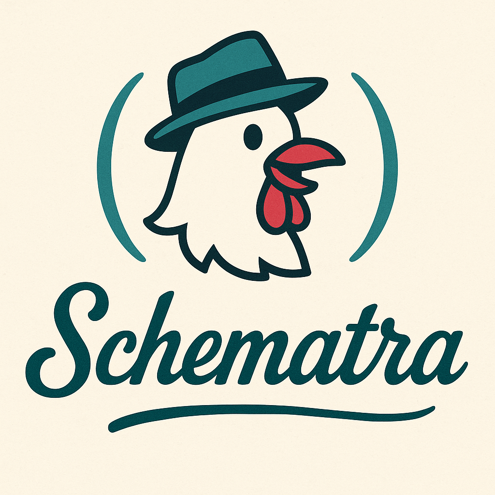

# Schematra



*A Sinatra love letter in Scheme*

A minimal web framework for [CHICKEN Scheme](https://call-cc.org/), inspired by [Sinatra](https://sinatrarb.com/). Schematra is currently an early exploration project created for learning purposes, but hopefully it will grow into something more useful over time.

## Why Schematra?

I created Schematra because I wanted to:

- **Improve my knowledge of scheme**: Building a web framework is a great way to explore a language's capabilities and idioms
- **Create something simple**: Most web frameworks are complex beasts. Schematra aims to be minimal and understandable
- **Enable modern web development**: The framework is designed to work well with modern tools like [Tailwind CSS](https://tailwindcss.com/) and [htmx](https://htmx.org/), making it easy to build interactive web applications without heavy JavaScript frameworks. Although tbh this is completely agnostic to how the framework works, it's what most of my examples will use.

## Features

- Simple route definition with `get`, `post`, etc. functions
- URL parameter extraction (e.g., `/users/:id`) & body parsing
- Middleware support
- Included naive session middleware (cookie storage)
- Development mode with REPL integration (leveraging emacs `run-scheme`)
- Very simple [hiccup](https://github.com/weavejester/hiccup) inspired template system
- Built on top of the solid [Spiffy](http://wiki.call-cc.org/eggref/5/spiffy) web server

## Installation

First, make sure you have [CHICKEN Scheme](https://call-cc.org/) installed. Once you have it installed, you can install schematra as an egg:

```sh
git clone https://github.com/rolandoam/schematra
cd schematra
chicken-install
```

That will download the dependencies and install the core modules so that they're available system-wide.

## Quick Start

Here's a simple "Hello World" application:

```scheme
(import schematra chiccup)

;; Define routes
(get ("/" params) "Hello, World!")

(get ("/users/:id" params)
     (let ((user-id (alist-ref "id" params equal?)))
	   ;; use chiccup to render html
	   (ccup/html `[html [body ,(format "User id: ~A" user-id)]])))

(post ("/submit" params)
      (let ((body (request-body-string req)))
        (format "Received: ~A" body)))

;; Start the server
(schematra-install)
(schematra-start port: 8080)
```

Save this as `app.scm` and run:

```bash
csi app.scm
```

Visit `http://localhost:8080` to see your application running.

## Development Mode

For interactive development, start the server in development mode:

```scheme
(schematra-start development?: #t port: 8080 repl-port: 1234)
```

This starts the web server in a background thread and opens an NREPL on port 1234. You can connect with your favorite Scheme editor or use `nc localhost 1234` for a simple REPL session.

For a more elegant environment, you can use emacs `run-scheme` by running `C-u M-x run-scheme RET nc localhost 1234`.

## Route Parameters

Schematra supports URL parameters using the `:parameter` syntax, as well as query params:

```scheme
(get ("/users/:user-id/posts/:post-id" params)
     (let ((user-id (alist-ref "user-id" params equal?))
           (post-id (alist-ref "post-id" params equal?))
           (q       (alist-ref 'q params))) ;; query params use symbol keys
       (format "User: ~A, Post: ~A" user-id post-id)))
```

The `params` argument contains both URL parameters (with string keys) and query parameters (with symbol keys).

## Route Handlers

Route handlers process HTTP requests and generate responses. Understanding how they work and what they should return is crucial for building Schematra applications.

### Handler Syntax

Every route handler uses the syntax `(verb (path params) body ...)`:

```scheme
(get ("/my-route" params)
  ;; Handler implementation
  )
```

- **`path`**: The URL path pattern (e.g., "/users/:id")
- **`params`**: An association list containing both URL path parameters and query parameters

### The Request Object

The `current-request` parameter is an [intarweb request](https://wiki.call-cc.org/eggref/5/intarweb#requests) that provides access to all aspects of the HTTP request:

```scheme
(get ("/debug" params)
     (let* ((req (current-request))
	        (method (request-method req))          ; 'GET, 'POST, etc.
            (uri (request-uri req))                ; Full URI object (uri-common egg)
            (headers (request-headers req))        ; Request headers
            (port (request-port req)))             ; Input port for body
       (format "Method: ~A, Path: ~A" 
               method 
               (uri-path uri))))
```

Common request operations:
- `(request-method request)` - Get HTTP method (GET, POST, etc.)
- `(request-uri request)` - Get URI object with path, query, etc. (see [uri-common](https://wiki.call-cc.org/eggref/5/uri-common))
- `(request-headers request)` - Get request headers
- `(request-body-string request)` - Read request body as string (useful for POST data)

For more, check [Intarweb](https://wiki.call-cc.org/eggref/5/intarweb).

### The Params Argument

The `params` argument is an association list containing two types of parameters:

1. **Path Parameters** (string keys): Extracted from URL segments starting with `:`
2. **Query Parameters** (symbol keys): Extracted from the URL query string

```scheme
;; Route: /users/:id?format=json&limit=10
;; URL: /users/123?format=json&limit=10
;; params = (("id" . "123") (format . "json") (limit . "10"))

(get ("/users/:id" params)
     (let ((user-id (alist-ref "id" params equal?))      ; Path param (string key)
           (format (alist-ref 'format params))           ; Query param (symbol key)
           (limit (alist-ref 'limit params)))            ; Query param (symbol key)
       (format "User ~A, format: ~A, limit: ~A" user-id format limit)))
```

### Handler Return Values

Route handlers can return different types of values, which Schematra automatically converts to the corresponding [intarweb response](https://wiki.call-cc.org/eggref/5/intarweb#responses):

#### 1. String Response (Most Common)

Return a string to send a 200 OK response with that string as the body:

```scheme
(get ("/hello" req params)
     "Hello, World!")  ; Returns 200 OK with "Hello, World!" body
```

#### 2. Response Tuple

Return a list in the format `(status body [headers])` for full control over the response:

```scheme
(get ("/custom" req params)
     '(created "Resource created successfully"))  ; Returns 201 Created

(get ("/with-headers" req params)
     '(ok "Success" ((content-type . "text/plain"))))  ; With custom headers
```

Some common valid status symbols include:
- `ok` (200)
- `created` (201)
- `found` (302) - for redirects
- `bad-request` (400)
- `unauthorized` (401)
- `forbidden` (403)
- `not-found` (404)
- `internal-server-error` (500)
- And [many others](https://wiki.call-cc.org/eggref/5/intarweb#responses) following HTTP status code conventions

#### 3. Halting the routing

Schematra provides helper functions for common response patterns:

```scheme
;; Redirect to another URL
(get ("/old-page" params)
     (redirect "/new-page"))  ; 302 redirect

;; Halt with specific status and message
(get ("/admin" params)
     (if (not (authenticated? req))
         (halt 'unauthorized "Access denied")
         "Welcome to admin panel"))
```

Redirect and halt both generate a specific signal that's captured by the main router and short-circuit any other processing: no other middleware or part of the route handler will be executed.

### HTML Responses with Chiccup

For HTML responses, use the included Chiccup rendering engine:

```scheme
(import chiccup)

(get ("/page" params)
     (ccup/html
      `[html
        [head [title "My Page"]]
        [body
         [h1 "Welcome"]
         [p "This is generated HTML"]]]))
```

### Working with Request Bodies

For POST requests, you can easily access the request body using `request-body-string`:

```scheme
(post ("/submit" params)
      (let ((body (request-body-string (current-request))))
        (if (string=? body "")
            '(bad-request "Empty request body")
            (format "Received: ~A" body))))
```

Since you have access to the intarweb request object, you can also access the object and its port directly if you want more control.

## Middleware

Schematra supports middleware functions that can process requests before they reach your route handlers. Middleware is useful for cross-cutting concerns like authentication, logging, request parsing, and session management.

### Using Middleware

Install middleware using the `use-middleware!` function:

```scheme
(use-middleware! my-middleware-function)
```

Middleware functions have the following signature:

```scheme
(define (my-middleware params next)
  ;; Process request/params before handler
  (display params)
  (let ((response (next)))  ; Call next middleware or handler
    ;; Process response-tuple after handler
    response))
```

### Middleware Parameters

- `params`: The route and query parameters alist
- `next`: A thunk (zero-argument function) that calls the next middleware in the chain or the final route handler

### Middleware Examples

#### Simple Logging Middleware

```scheme
(define (logging-middleware params next)
  (let* ((request (current-request))
         (method (request-method request))
         (uri (request-uri request))
         (path (uri-path uri)))
    (log-dbg "~A ~A" method (uri->string uri))
    (next)))

(use-middleware! logging-middleware)
```

#### Authentication Middleware

```scheme
(define (valid-token? header)
  (and (list? header)
       (= 1 (length header))
       (vector? (car header))
       (string=? (symbol->string (get-value (car header))) "bearer")
       (string=? (symbol->string (caar (get-params (car header)))) "secret")))

;; detail of the headers content: https://wiki.call-cc.org/eggref/5/intarweb#headers
(define (auth-middleware params next)
  (let ((auth-header (header-contents 'authorization (request-headers (current-request)))))
    (if (and auth-header (valid-token? auth-header))
        ;; Continue to next middleware or route
        (next)
        ;; Return error response
        '(unauthorized "You don't belong here"))))

(use-middleware! auth-middleware)
```

### Middleware Execution Order

Middleware is executed in the order it's installed with `use-middleware!`. The first middleware installed runs first on the request, and last on the response:

```scheme
(use-middleware! middleware-a)  ; Runs first
(use-middleware! middleware-b)  ; Runs second
(use-middleware! middleware-c)  ; Runs third

;; Execution flow:
;; Request: middleware-a -> middleware-b -> middleware-c -> route-handler
;; Response: route-handler -> middleware-c -> middleware-b -> middleware-a
```

### Built-in Middleware

Schematra includes session middleware for cookie-based session management. See the "Session Management" section for details on using the session middleware.

## Working with Modern Web Tools

Schematra plays nicely with modern web development tools:

### Tailwind CSS

Include Tailwind via CDN in your HTML responses:

```scheme
(get ("/tw-demo" params)
     (ccup/html
      `[html
        [head [script (("src" . "https://cdn.tailwindcss.com"))]]
        [body.bg-gray-100.p-8 [h1.text-3xl.font-bold.text-blue-600 "Hello, Tailwind!"]]]))
```

### htmx

Add htmx for dynamic interactions:

```scheme
(get ("/htmx-demo" params)
     (ccup/html
      `[html
        [head [script (("src" . "https://cdn.jsdelivr.net/npm/htmx.org@2.0.6/dist/htmx.min.js"))]]
        [body
         [button (("hx-get" . "/clicked") ("hx-target" . "#result")) "Click me!"]
         [\#result]]]))

(get ("/clicked" params)
     (ccup/html `[p "Button was clicked!"]))
```

## Session Management

Schematra includes a simple session middleware that stores session data in HTTP cookies. Sessions are automatically serialized and deserialized on each request.

### Basic Usage

First, install the session middleware with a secret key:

```scheme
(import sessions)

;; Install session middleware
(use-middleware! (session-middleware "your-secret-key-here"))
```

Then use session functions in your route handlers:

```scheme
(get ("/login" params)
     (session-set! "user-id" "12345")
     (session-set! "username" "alice")
     "Logged in successfully")

(get ("/profile" params)
     (let ((user-id (session-get "user-id")))
       (if user-id
           (format "Welcome user ~A" user-id)
           "Please log in")))

(get ("/logout" params)
     (session-delete! "user-id")
     (session-delete! "username")
     "Logged out")
```

### Session Functions

- `(session-get key [default])` - Retrieve a value from the session
- `(session-set! key value)` - Store a value in the session
- `(session-delete! key)` - Remove a key from the session

### Configuration

You can customize session behavior using parameters:

```scheme
;; Set session cookie name (default: "schematra.session_id")
(session-key "myapp_session")

;; Set session expiration time in seconds (default: 24 hours)
(session-max-age (* 7 24 60 60))  ; 1 week
```

### Security Notes

- Sessions are stored as serialized data in cookies (client-side storage)
- The secret key is used for session identification but not encryption
- Avoid storing sensitive data in sessions
- Consider implementing proper encryption/signing for production use
- Session cookies are HTTP-only by default to prevent JavaScript access

## Current Status

**This is still an exploration project!** Schematra is still in early development and should not be used for production applications. Currently we have:

- Limited error handling
- Simple HTML rendering library [chiccup](chiccup.scm), a [hiccup](https://github.com/weavejester/hiccup)-inspired rendering engine.
- Middleware system, with a couple of core modules to provide some basic services ([sessions](sessions.scm), [csrf](schematra-csrf.scm), [oauth2](oauthtoothy.scm))
- SSE support (will add WebSockets soon)
- No database integration, but you can use any [database egg](https://eggs.call-cc.org/5/#db) and create a middleware to provide a persistance layer.
- No background job system (working on one though, using the [hiredis wrapper](https://github.com/rolandoam/chicken-hiredis/))

While not ready for production, it's perfect for:
- Learning Scheme
- Prototyping simple web applications
- Experimenting with htmx and Tailwind CSS
- Understanding how web frameworks work under the hood

## Contributing

If you find Schematra interesting and want to help it grow beyond a toy project, contributions are welcome! Feel free to:

- Report bugs or suggest features via GitHub issues
- Submit pull requests with improvements
- Share your experience using Schematra
- Help improve the documentation

## License

This program is free software: you can redistribute it and/or modify it under the terms of the GNU General Public License as published by the Free Software Foundation, either version 3 of the License, or (at your option) any later version.

See the source code for the complete license text.
